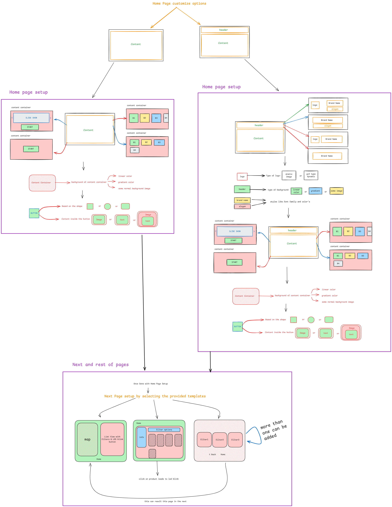
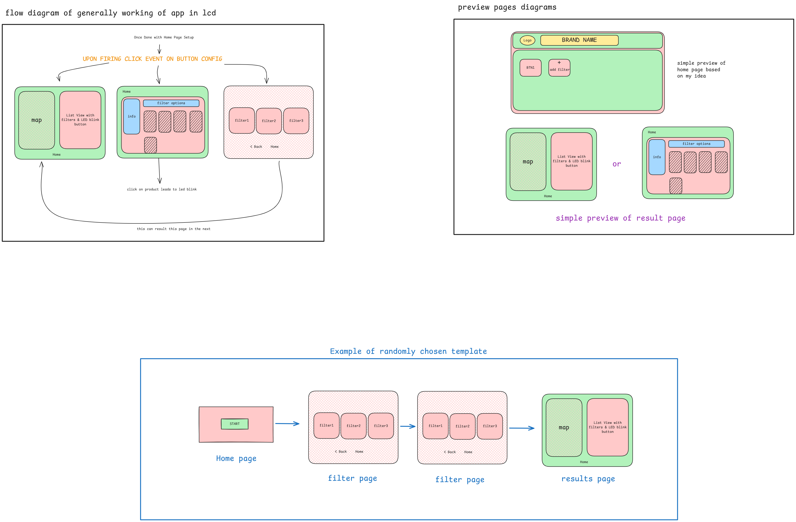
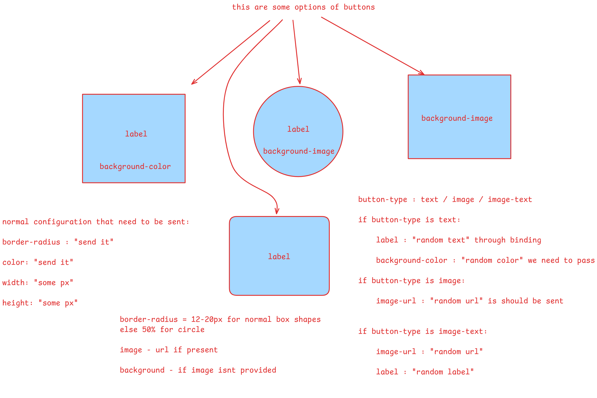
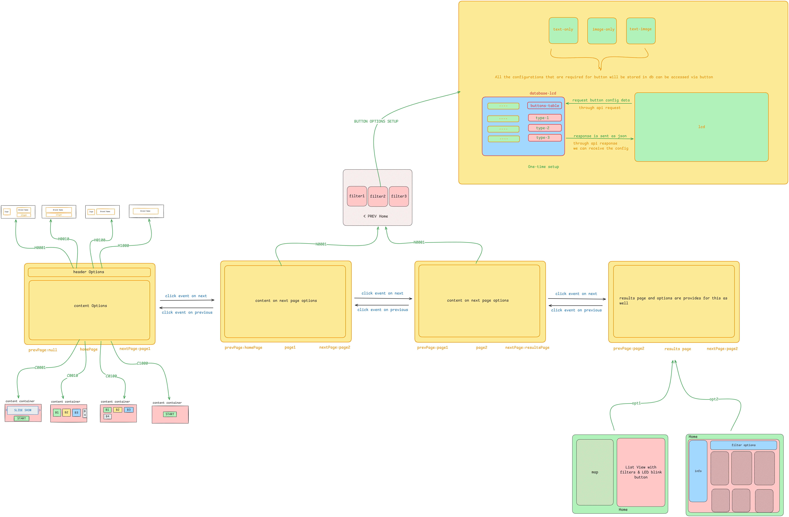
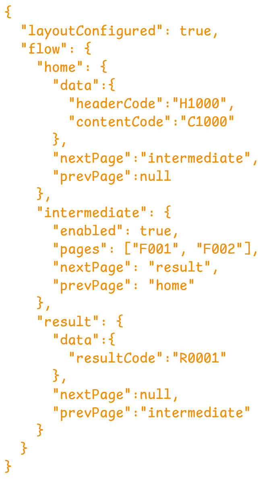

# Dynamic LCD Application

- Its an Application which eliminates the building of applications which is having same funcitonality and features just different ui representation by providing multiple theme options.

## Development of this Application went through this steps

- below are the Flow charts or Design diagrams.

- sample idea design
    

- sample output design
    

- Evolution of button customization design
    

- Final and updated Design
    

- Final JSON Structure
    

## Many More will be added

- coming soon...
